# Entendendo sobre roteamento, dns e o uso de IPV6

## Roteamento interno 

- O roteamento é o processo de encameamento e definição das rotas de qual pacotes de dados que vão utilizar nas nossas redes.
- Neste projeto, utilizei exatamente o o mesmo projeto de vlans e acrescentei mais um roteador, switch e um servidor para que poder configurar o provedor de internet
- no roteador ISP-1 A configurei da seguinte forma:
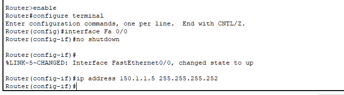


- ISP-1 B 
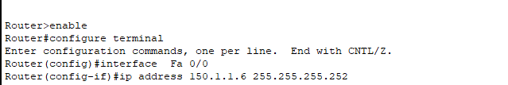

- Servidor ISP
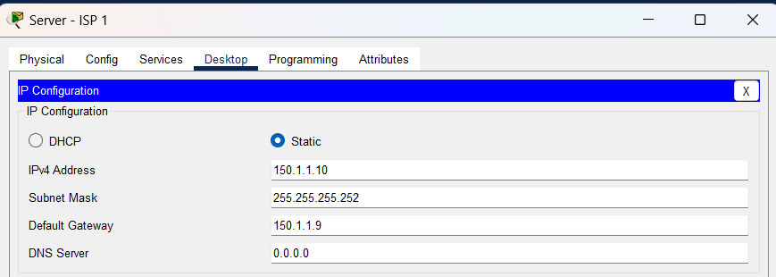

- configurando o roteador dhcp para conectar na subrede do roteador que esta conectando o servidor e atriubiar a interface que é a serial
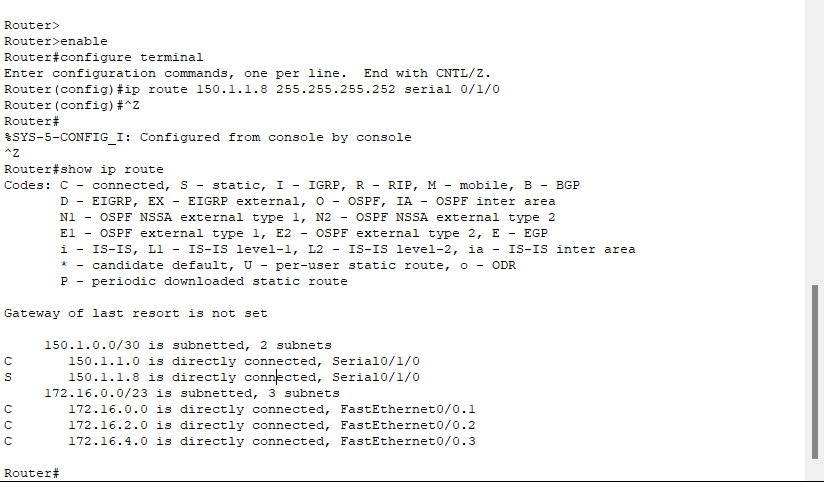


### Protocolo RIP 
- O protocolo Routing information Porotocol (RIP) Ele basicamente atua da seguinte forma, os roteadores vão compartilhar informações de roteamento entre si, informando quais rotas cada um dos roteadores conhece. Sendo assim, o roteador A vai saber quais redes o roteador B conhece e com isso vai poder decidir se vai encaminhar um pacote para o roteador B ou não.

- Configurando roteador para usar o protocolo RIP
- Roteador A ISP-1A
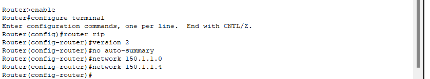

- No roteador B eu repliquei essas mesmas configurações e adicionei ip diferente
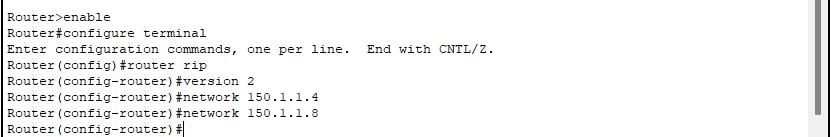

- Com os roteadores configurados para usar o protocolo RIP, ainda possui uma limitação pois o protocolo RIP na hora de um pc enviar informação a um outro pc que esta em um roteador diferente,  o protocolo RIP é "acionado" e faz a contagem de quandos roteadores está no no caminho para entrar a informação a um outro pc, então ele faz saltos. Ex: " um computador conectado ao roteador A que precisa enviar informações para um computador conectado ao roteador C, e esses roteadores estão interligados por meio do roteador B, a rota terá 2 saltos. Isso porque o pacote de dados precisa primeiro ir do computador para o roteador A, depois do roteador A para o roteador B, e finalmente do roteador B para o roteador C, onde está o computador de destino. Portanto, são 2 saltos no total.  " E esse protocolo é normalmente usado em redes mentor e não leva consideração a latência e velocidade, apenas  o  número de roteadores. E para resover essa limitação de considerar a latencia e velocidade, é recomendado utilizar o protocolo OSPF.

- Para utilizar o protocolo OSPEF, eu configurei alguns roteadores, switches e servidores, abaixo tem a explicação de passo a passo feito pela Alura.
```bash 
Acessamos a aba CLI do roteador ISP 1 - B, entramos no modo de configuração e habilitamos a interface serial 0/1/0 com os comandos interface serial 0/1/0 e no shutdown. Então, atribuímos o endereço IP 160.1.1.1 para a interface usando ip address 160.1.1.1 255.255.255.252.

Dessa vez, acessamos a aba CLI do roteador ISP 2 - C, inserimos no para configurá-lo no modo dialog, entramos no modo de configuração e habilitamos a interface serial 0/1/0 com os comandos interface serial 0/1/0 e no shutdown. Usando a mesma sub-rede 1, atribuímos um endereço IP para a interface com ip address 160.1.1.2 255.255.255.252.

Ainda no roteador ISP 2 - C, no modo de configuração, saímos da interface serial com o comando exit e acessamos a interface FastEthernet 0/0 com interface Fa0/0 (conexão entre os roteadores ISP 2 - C e ISP 2 - D). Habilitamos a interface com no shutdown* e atribuímos um endereço IP da sub-rede 2 com ip address 170.1.1.1 255.255.255.252.

Na sequência, saímos da interface FastEthernet 0/0 com exit e acessamos a interface FastEthernet 0/1 com interface Fa0/1 (conexão entre ISP 2 - C, Switch ISP 2 A e Server ISP 2 A). Habilitamos a interface com no shutdown e atribuímos um endereço IP da sub-rede 3 com ip address 180.1.1.1 255.255.255.252.

No Server ISP 2 A, clicamos na aba Desktop e selecionamos a opção IP Configuration. Então, inserimos o endereço IP 180.1.1.2 no modo estático no campo IPv4, a máscara de rede 255.255.255.252 e o default gateway 180.1.1.1.

Então, acessamos a aba CLI do roteador ISP 2 - D, inserimos no para configurá-lo no modo dialog, entramos no modo de configuração e habilitamos a interface FastEthernet 0/0 com os comandos interface Fa 0/0 e no shutdown (conexão entre os roteadores ISP 2 - C e ISP 2 -D). Atribuímos um endereço IP da sub-rede 2 com ip address 170.1.1.2 255.255.255.252.

Ainda no roteador ISP 2 - D, saímos da interface FastEthernet 0/0 com exit e habilitamos a interface FastEthernet 0/1 com interface Fa0/1 e no shutdown. Nesta interface, utilizamos um endereço IP da sub-rede 4 com ip address 190.1.1.1 255.255.255.252.

Por fim, no Server ISP 2 B, clicamos na aba Desktop e selecionamos a opção IP Configuration. Então, inserimos o endereço IP 190.1.1.2 no modo estático no campo IPv4, a máscara de rede 255.255.255.252 e o default gateway 190.1.1.1.

Verificamos a tabela de roteamento dos roteadores configurados na rede, entrando na aba CLI no modo enable e usando o comando show ip route. Observamos que, conforme esperado, os roteadores só possuíam informações das redes diretamente conectadas em suas interfaces
```

- Configurando o OSPEF no roteador ISP 2 - C
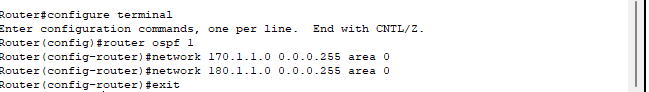

Configurando o OSPEF no roteador ISP 2 - D
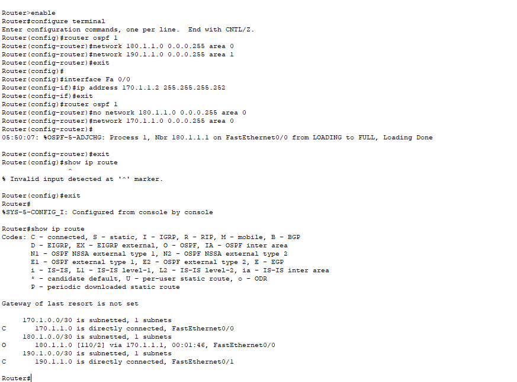

- O OSPF (Open Shortest Path First) é um protocolo de roteamento que pode se adaptar facilmente ao crescimento da rede, oferecendo escalabilidade, convergência rápida e adaptabilidade às mudanças na topologia.


# Roteamento Externo

- BGP: Border Gateway Protocol, este protocolo vai atuar no encaminhamente das inforamções em redes diferentes. O protocolo OSPEF como ele é utilizado mais em redes pequenas, para que essa rede consiga fazer uma comunicação com redes externas é necessário configurar os roteadores utiliznado o protocolo BGP.

- Configurando o roteador ISP1 - B
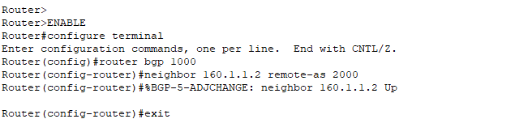

- Repetindo o processo no C
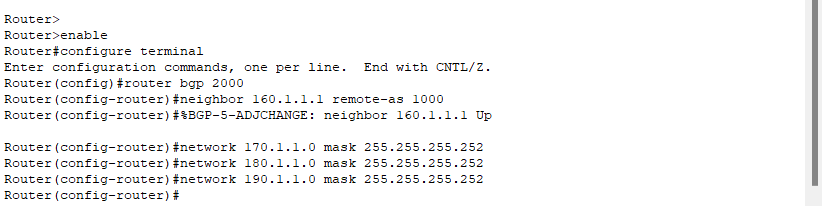


- Verificando se deu tudo certo utilizando o BGP no roteador ISP1 - B
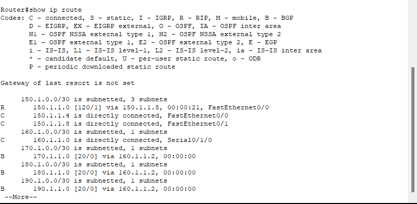

- Retorno se deu tudo certo: 
```bash
     150.1.0.0/30 is subnetted, 3 subnets
R       150.1.1.0 [120/1] via 150.1.1.5, 00:00:21, FastEthernet0/0
C       150.1.1.4 is directly connected, FastEthernet0/0
C       150.1.1.8 is directly connected, FastEthernet0/1
     160.1.0.0/30 is subnetted, 1 subnets
C       160.1.1.0 is directly connected, Serial0/1/0
     170.1.0.0/30 is subnetted, 1 subnets
B       170.1.1.0 [20/0] via 160.1.1.2, 00:00:00
     180.1.0.0/30 is subnetted, 1 subnets
B       180.1.1.0 [20/0] via 160.1.1.2, 00:00:00
     190.1.0.0/30 is subnetted, 1 subnets
B       190.1.1.0 [20/0] via 160.1.1.2, 00:00:00

```

- B = BGP

- Divulgando as redes pelo BGP no roteador ISP1 - B
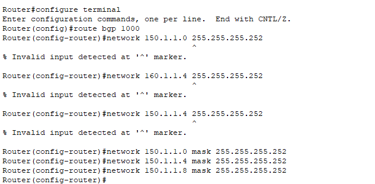

- Verificando se esta chegando as redes no roteador ISP2 - C
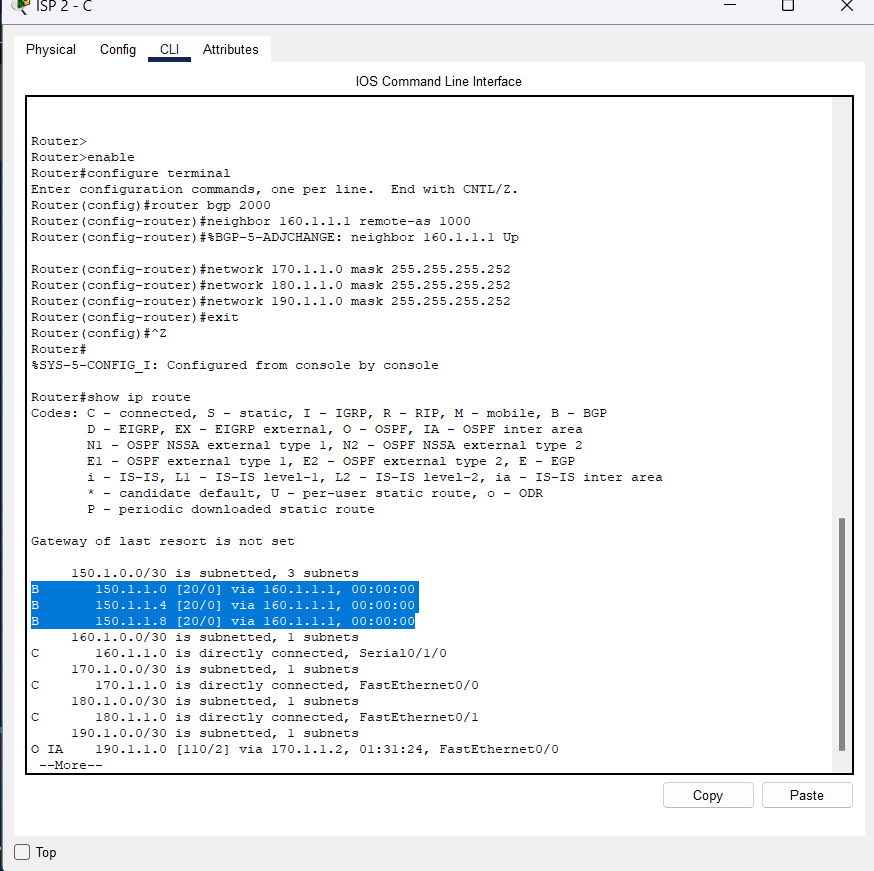


