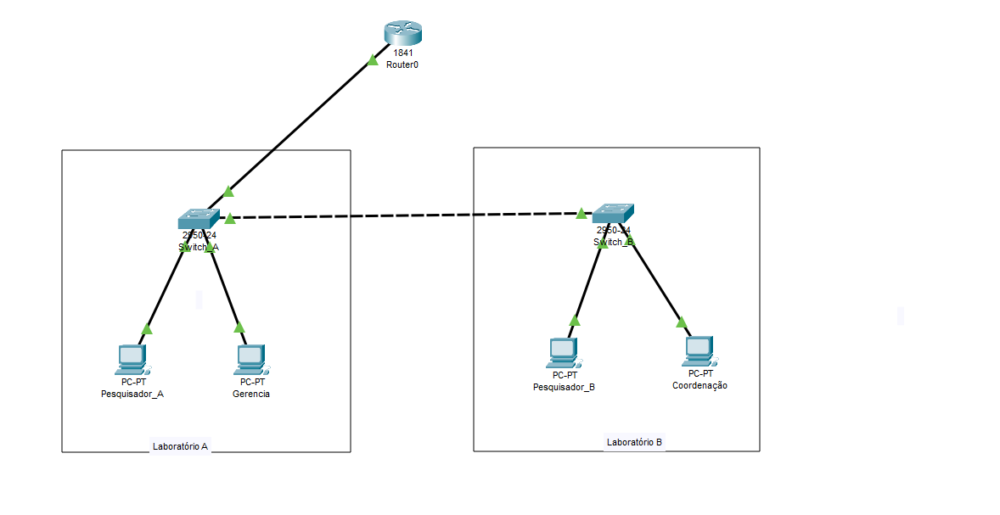
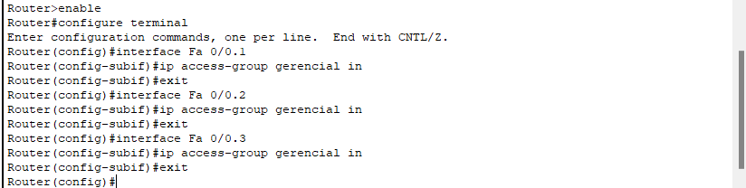

# VLANs

- Neste momento, criei 2 laboratórios e cada laboratório possui um switch e duas máquinas. Os dois laboratório estão se comunicando, os 2 switch estão sendo conectados através de um cabo cruzado. 


- Com isso feito, na hora de dar um ping de uma maquina para uma outra máquina que está em outro laboratório, o envio de pacotes será feito para todas as máquinas até encontrar a máquina que possui o endereçamento IP correspondente ao ip passado no ping. Para evitar esse congestionamento, melhorar o trafego de comunicação, criei uma VLAN. Em cada switch dos laboratórios, ativei a VLAN e fiz essas seguintes configurações:


- configure terminal -> entrei no modo de configuração no terminal
- show vlan brief -> Analisa todas as configurações de VLAN existente no switch. Cada vlan possui um identificador, sendo 1 a 1005
- vlan 10 e vlan 20 -> Criando uma vlan 
- na vlan 10, atribui um nome a essa vlan como pesquisa e na vlan 20 como administrativo


- Com isso criado, é necessário configurar/vincular a interface da porta fastEthernet para acesso a vlan criada que neste caso é a vlan 10:


- vlan 20


- Pronto, agora note que o comando **show vlan brief** vai mostrar as duas vlan criada com o status de **active**


- Fiz o mesmo processo para o segundo laboratório


- na hora de fazer um teste de conexão com o ping, o retorno de mensagem é timout, pois a interface que esta conectado entre os switch não está configurados para que os pacotes seja encaminhado para diferentes vlans configurados nos switchs.


- Configurando a interface da porta do switch


- enable -> entrei como root no switch
- configure terminal -> entrei na configuração do switch pelo terminal
- interface Fa 0/3 -> entrei na interface/porta que esta conectado o swtich
- switchport mode trunk -> ativa a interface para transmitir e receber pacotes de múltiplas VLANs

- Ao realizar o teste para o ip 193.168.0.4 recebo uma mensagem de timeout indicando um erro, porém ao fazer um ping no ip 193.168.0.3, funciona normalmente


- Isso ocorre porque a máquina Pesquisador_A e pesquisador_B estão conectados na mesma vlan, que é a vlan10. E o motivo de não conseguir realizar o ping no ip 193.165.0.4 é que esta em vlan diferente, durante o funcionamento as vlan não enxerga uma as outras, sendo assim, foi necessário um roteamento entre elas para que os pacotes saíam de um pc que esta em uma vlan para outro pc que esta em uma outra vlan.

- Ficou dessa forma o roteamento de vlans, para que a comunicação de pcs que estão em vlans diferentes se comuniquem com sucesso, por padrão quando adicionado um roteador no cisco

- Quando adicionado, ele vem com uma interface desligada e basta apenas configura-lo da seguinte forma: 


- Com a interface ligada, configurei o dhcp para cada uma das vlan existente no projeto.


- subinterface, para a comunicação ser efetiva com sucesso criei duas subinterface para que o dhcp funcione corretamente e atribua de forma automatica um endereço ip para os pc que estão em duas vlans diferentes. Sem a subinterface, o roteador não conseguirá atribuir o endereçamento ip para os dispositivos que estão em vlans diferentes e também para realizar o roteamento entre as vlans para que as máquinas consigam se comunicar


### vlan10
- interface Fa 0/0.1 -> criando uma subinterface 
- encapsulation dot1Q 10 -> vinculando a subinterface na vlan10
- ip address 192.168.10.1 255.255.255.0 -> atribuindo um endereço ip para a subinterface

### vlan20
- interface Fa 0/0.2 -> criando uma subinterface 
- encapsulation dot1Q 20 -> vinculando a subinterface na vlan20
- ip address 192.168.20.1 255.255.255.0 -> atribuindo um endereço ip para a subinterface

- gateway das vlans e subinterfaces criada, o gateway é a propria subinterface criada


- Ficando dessa forma:


# Rededundância de links com STP 


- Adicionei mais um switch e acabou criando uma malha na rede, note que no projeto o switch do laboratório B tem uma porta em laranja, isso ocorreu porque quando fazemos um ping, ele possui o TTL e esse TTL conta quantos dispositivos de rede o pacoute passou. Então dessa forma, quando uma mensagem chega em um switch, a mensagem fica circulando no switch causando um congestionamento na rede... E para resolver esse tipo de coisa, é utilizado o protocolo STP, e este protocolo que esta derrubando a porta que esta na malha de rede para impedir que de tal forma para que a mensagem não fique ali "girando" eternamente.

- STP: Spanning Tree Protocol -> Este protocolo, ele torna um switch root, um switch principal e para que isso seja possível, os switch precisa ter umas trocas de mensagem. E para ter essa troca de mensagem, é utilizado o protocolo BDPU
- BDPU: Bridge Protocol Data Unit -> Esse protocolo, existe dois campo. Um campo de prioridade e endereço MAC,  e este protocolo os dispositivo vão fazer essa troca de mensagem e a seleação de um switch root vai ser em base naquele switch que tiver a menor prioridade. E a prioridade desse protocolo, por default é de 32.768

- é poissivel verificar qual switch é o root com o comando show spanning-tree vlan 10

- Note que a prioridade esta 32778 e não 32768 que é o padrão, ele está com este valor de 32778 por conta do 10 atribuido na vlan


# Configurando subredes
- Aqui, eu configurei uma subrede no roteador utilizando uma mascara de rede ajustada 255.255.254.0 da classe B


- Com isso feito, atualizei os novos endereço IP das interface utilizando a subrede criada


- Com tudo isso feito, basta apenas reiniciar o DHCP, na cisco basta apenas colocar static e depois para dhcp novamente para pegar novos iP e realizei um novo teste de conexão para ter certeza se esta tudo correto, e aqui esta:


# Configurando um servidor e adicionando politicas de acesso

- Aqui neste tópico, adicionei um servidor que vai ter uma politica de acesso


- Para realizar a configuração corretamente, em cada switch na rede criei uma terceira vlan e uma terceira subinterface, modifiquei para que o servidor tenha acesso ao a porta Fa 0/4
* vlan30


- o servidor ficou com essas configurações estáticas


- Com isso criado, realizei teste na cisco em real time para verificar os protocolos que estão sendo trabalhado. 

- Note que é o protocolo TCP que esta trabalhando e é o responsável por fazer o transporte de dados seguros por todo o tráfego de rede.

- TCP -> Este protocolo é o principal protocolo da camada de transporte, ele permite uma comunicação confiável e segura entre dois dispositvos. Ou seja, no momento que acessar o servidor configurado no ip 172.16.4.2, o TCP vai encaminhar uma mensagem para o servidor de "sincornização" e vai respoonder com uma mensagem de confirmação na hora de sincronizar, e o pc que esta tentando conectar ao servidor tambem manda uma mensagem de confirmação que será sincronizado e por fim, realizar a conexão através de uma porta, o famoso aperto de mão triplo. Ou seja, durante todo esse processo o protocolo garante que não perca nenhum tipo de dado durante o caminho de "sincronização" . Depois dessas confirmação de aperto de mão triplo, entra o procotocolo HTTP de acordo no print tirado acima, que basicamente é uma resposta do servidor para o pc que esta conectando ao servidor. Isso tudo permite realizar a configuração de politica de acesso.
- UDP ->  Esse protocolo é mais usado para a velocidade de conexão entre os dispositivos, mas pode ter algumas perdas de informação utilizando UDP

## Lista de acesso
- aqui, no pc Gerencia, atribui um ip estático: 


- fiz o mesmo com o pc da coordenação.
- Para que funcione corretamente, foi necessário realizar as seguintes configurações no roteador:


```bash 
Router(config)#ip dhcp excluded-address 172.16.2.2 # EXLUINDO OS ENDEREÇOS IP
Router(config)#ip dhcp excluded-address 172.16.2.3 # EXLUINDO OS ENDEREÇOS IP 
Router(config)#ip access-list extended gerencial # LISTA DE EXENTED, ELE COMPARA OS ENDEREÇO IP DE ORIGEM E DESTINO, o standart faz a comparação apenas do DESTINO e adicionado o nome gerencial
Router(config-ext-nacl)#permit tcp 172.16.2.2 0.0.0.0 172.16.4.2 0.0.0.0 # PERMITINDO O ACESSO TCP DESSE IP
Router(config-ext-nacl)#permit tcp 172.16.2.3 0.0.0.0 172.16.4.2 0.0.0.0 # PERMITINDO O ACESSO TCP DESSE IP
Router(config-ext-nacl)#deny tcp 172.16.2.6 0.0.255.255 172.16.4.2 0.0.0.0 # NEGANDO  QUALQUER ACESSO QUE NAO ESTEJA NA LISTA 
Router(config-ext-nacl)#permit ip any any 
Router(config-ext-nacl)#exit
```
- permit tcp 172.16.2.2 0.0.0.0 172.16.4.2 0.0.0.0 -> Significa que o endereço ip tem que ser exatemente igual do que esta sendo solicitado, se tiver permit tcp 172.16.2.2 0.0.255.255, qualquer máquina vai ter acesso pois todas as máquinas tem o mesmo "digito" os mesmos dois primeiros octetos iguais.

- Agora, configurei o roteador para realizar a vinculação das subinterfaces na lista de gerencial, na lista de acesso


- Com isso tudo isso feito, agora, apenas os pc da gerencia e coordenação consegue acessar o servidor. O restante esta bloqueado
- pc pesquisador:


- pc gerencia:


## Conectando a uma rede externa
- Criei um roteador que vai ser uma simulação de provedor de serviço a internet. E fiz uma conexão com o cabo entre o roteador de que vai ser o provedor de interet (rede externa) e o roteador dhcp (rede interna)
- Na cisco, tive que adicionar uma porta para realizar um conversor de sinal  WIC-1T e utilizar o conector Serial DCE que por sua vez é um cabo


## Configuração do provedor de seviços
- roteador

roteador


- provedor de serviço: 


- NAT -> Basicamente este procotolo faz uma tradução de um ip privado para um ip publico
- Utilizei o NAT para que todos os positivos tenham apenas um unico IP e fiz essa configuração:


- Nessa configuração, configurei as informando quais serão internas e externas, onde "inside é interno e "outside" externo. Configurei também as listas de NAT

- Aqui foi o teste de conexão para verificar se o NAT está funcionando corretamente.
