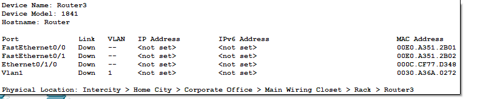
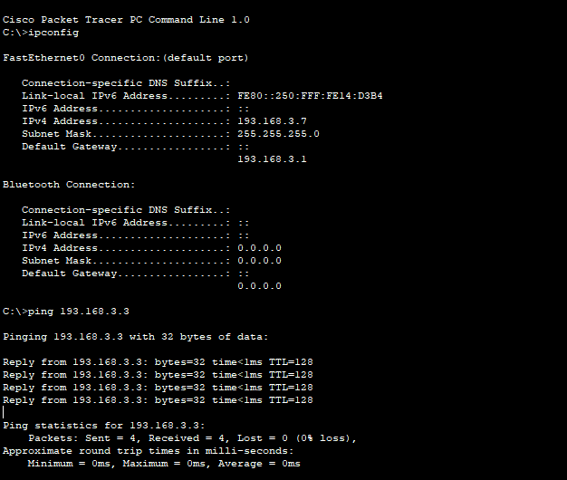
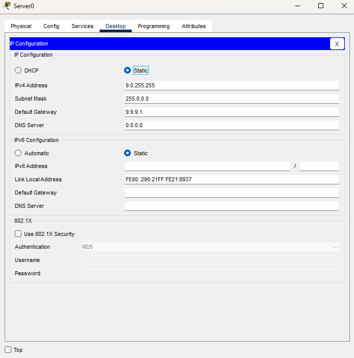

# Aprendizado em REDES DE COMPUTADORES 
## Camadas Modelo OSI

## Camada 1 – a Camada física. 
- A camada física envia e recebe fluxos de bits brutos em uma mídia física.


## Camada 2 – a Camada Enlace (link de dados). 
- Essa camada define o formato dos dados a serem transmitidos, dividindo em quadros para transição na camada física. Ela também gerencia conexões entre dois nós diferentes, gerencia o controle de erros e encerra conexões quando uma sessão é concluída.


## Camada 3 – a Camada de rede. 
- A camada de rede é responsável por encaminhar e rotear pacotes de dados de forma eficiente em várias redes.


## Camada 4 – a Camada de transporte. 
- Essa camada coordena a transferência de dados confiável e transparente de ponta a ponta entre os hosts de rede.


## Camada 5 – a Camada de sessão.
- A camada de sessão gerencia as sessões de comunicação e a sincronização entre aplicações em diferentes dispositivos. Ela também lida com configuração, autenticação, terminação e reconexões.


## Camada 6 – a Camada de apresentação. 
Essa camada converte dados para a camada de aplicação, tratando a formatação, compactação, criptografia e descriptografia de dados.


## Camada 7 – a Camada de aplicação. 
Essa camada fornece serviços de rede diretamente a aplicações, incluindo protocolos para e-mail, navegação na Web e transferência de arquivos.

#

## Modelo TCP/IP
## Existem apenas 5 camadas do modolo TCP/IP, sendo elas:
- As camadas da arquitetura OSI: Aplicação, Apresentação e Sessão. São agrupadas em uma única camada **[Aplicação]** na arquitetura TCP/IP 
- As camadas da arquitetura OSI: transporte é a única camada **[transporte]** na arquitetura TCP/IP 
- As camadas da arquitetura OSI: rede é a única camada **[rede]** na arquitetura TCP/IP 
- As camadas da arquitetura OSI: Enlance é a única camada **[Enlance]** na arquitetura TCP/IP 
- As camadas da arquitetura OSI: Físico é a única camada **[Físico]** na arquitetura TCP/IP 

# Comandos
## traceroute 
- este comando verifica a rota de tráfego da rede

## nslookup
- este comando analisa o funcionamento do protocolo DNS


# 

# Primeiros passos

## Criando uma rede com 3 computadores utilizando o HUB
- Aqui, criei 3 pcs com os nomes: ManuFatura, Acabamento e Embalagem. 
- Criei um HUB, e realizei uma conexão cabeada (usei um cabo direto) no HUB entre as máquinas
- Utilizei as portas FastEthernet nas máquinas e no HUB


- Em cada uma das máquinas, configurei um IP estático sendo eles:
- ManuFatura = 193.168.3.1 | Acabamento = 193.168.3.2 | Embalagem = 193.168.3.3
- Realizei o teste de conexão da máquina ManuFatura para a maquina Acabamento:


- Os hubs não memorizam o endereço e localização de cada máquina, sendo assim, ao receberem uma mensagem, a encaminham para todas as demais máquinas conectadas. Caso ocorra um fluxo intenso de tráfego na rede, teremos essa informação sendo encaminhada para todos os demais usuários causando lentidão e congestionamento na rede. Além disso, quando usuários enviam uma mensagem destinada para um usuário específico, os demais usuários da rede também irão recebê-la, causando assim uma vulnerabilidade de segurança.


## Criando uma rede com 3 computadores utilizando o switch
- Criei um switch e 3 máquinas, realizei a conexão entre as máquinas e o switch utilizando cabo direto
- IPS: maquina1 = 193.168.3.10 | maquina2 = 193.168.3.20 | maquina3 = 193.168.3.30
- Foi feito o teste de ping da maquina1 para a maquina3 


- Os switches são dispositivos mais inteligentes que os hubs, pois conseguem identificar o endereço MAC de cada máquina conectada às suas portas. Dessa forma, ao receberem uma mensagem, eles analisam o destino e a encaminham diretamente para a porta correspondente, evitando o envio desnecessário para todas as demais máquinas da rede. Isso reduz significativamente o tráfego desnecessário, melhorando o desempenho e a eficiência da rede, mesmo em cenários com fluxo intenso de dados. Além disso, como as mensagens são direcionadas apenas ao destinatário correto, o switch proporciona maior privacidade e segurança, impedindo que outros usuários da rede recebam informações que não lhes dizem respeito.

## Mascara de rede 

- A máscara de rede é usada para dividir o endereço IP em dois grupos: a identificação da rede e a identificação do host (máquina). Por exemplo, com a máscara 255.255.255.0, os três primeiros octetos do endereço IP representam a rede (193.168.3), e o último octeto é usado para identificar os diferentes dispositivos conectados à mesma rede. Por isso, endereços IP como 193.168.3.10, 193.168.3.20 e 193.168.3.30 pertencem à mesma rede, mas cada um identifica uma máquina diferente.

- Para testar esse aprendizado, eu mudei apenas o 1 digito do primeiro octeto de cada maquina (191.168.3.10 | 192.168.3.20 | 193.168.3.30), ambos estão usando a mesma classe: 255.255.255.0 e certamente estão em redes diferentes e na hora de fazer um teste de ping, recebo um timeout nas 4 tentativas de envio do pacote


### Roteador
- Para que as máquinas em redes diferentes possam se comunicar, utilizei um roteador e fiz a conexão de cabo cruzado. Feito isso, aparentou a sinalização vermelho durante o estudo pois no switch e no hub essas configurações foi feita de forma automática. No roteador, as portas não possuem um endereço IP para elas, então será necessário configurar as portas.


- configurando o **roteador**: Para configurar o roteador, será necessário um cabo console conectado numa porta serial da máquina. Para isso, na cisco criei uma máquina chamada "maquinaConfiguracaoRede" e utilizei um cabo console na porta RS 232 da máquina que é a porta serial e na porta do roteador, a porta console. 

- Com o cabo console conectado ao roteado e a máquina, será apresentado uma tela como esta:


- **Dica** caso tenha duvida de qual comando utilizar, use "?" para saber as possibilidades de comandos que pode ser usados no terminal ou para saber o que tal comando faz. 
```
[command] ?
```

- Após digitar "no" no terminal, para que não inicie configuração de dialogo ou algo do tipo será necessário entrar como root no roteador
```bash
enable
```
- O comando **enable** entra como um usuario root, um usuario com todos os privilégios para executar tais comando
- Após digitar o comando enable, digitei o comando **configure** e repondi uma pergunta apresentada pelo roteador para especificar que quero configurar o retoeador atraves de um terminal
```bash 
configure
```


- no modo de configuração, configurei as portas do roteador

```
interface FastEthernet 0/0
```


- na interface de configuração, executei
```
no shutdown
```


- Com o comando anterior, significa que não é para desligar a porta FE 0/0 e a porta foi ligada apresetando um sinal verde no projeto


- Porem, com isso feito, esta porta precisa de um endereço IP atribuido a porta
```
ip address 191.168.3.40 255.255.255.0
```


- Fiz o mesmo processo para as demais portas, para isso será necessário sair com o comando **exit** e entrar na proxima interface
ex:
```
exit
interface FastEthernet 0/1
```


- Com isso feito nas outras portas colocando cada uma em uma rede diferente, elas estão prontas para receber conexão das máquinas

### Configurando as máquinas para receber conexão das redes criadas
- na maquina1 ficou da seguinte forma: 193.168.3.41
- na maquina2 ficou da seguinte forma: 193.168.2.41
- na maquina3 ficou da seguinte forma: 193.168.4.41

- Gateway, para as maquinas comunicarem entre si, configurei o gateway das máquinas com o ip das portas do roteador informando qual será o ponto de saída dos pacotes. Ou seja, quando utiliza o comando ping em um ip que está numa rede diferente, o ping enviará um pacote que está em uma rede diferente.


- Com isso feito, fiz o teste de conexão da maquina1 que esta em uma rede com a outra maquina2 que esta em uma rede diferente, ambas usando a classe C


## DHCP
- Diferente de atribuição manual dos ip das máquinas (estático) o dhcp faz isso de forma automática, atribui as máquinas o endereço ip
- Para configurar, entrei na parte de CLI do proprio switch que a cisco permite, ao invés de fazer as conexões com cabo console etc.
- Entrei como usuario root, entrei no terminal de configuração e executei a configuração dhcp:

- No modo de configuração DHCP, inicie a configuração de ip e sua mascara de rede
```
network 193.168.3.0 255.255.255.0
```

- Com o endereço ip atribuido na rede, agora é necessário atribuir o gateway no servidor dhcp
```
default-router 193.168.3.1
```


- Com isso feito, é necessário adicionar na porta que o switch esta conectado o gateway da seguinte forma:
```
exit

interface fastEthernet 0/0
no shutdown
ip address 193.168.3.1 255.255.255.0
```


- Feito isso, agora basta apenas ativar o DHCP nas máquinas ficando da seguinte forma;


- Fiz um teste de comunicação da maquina7 para a maquina3 com o ping


## Criando um servidor que esta rodando uma aplicação básica
- Para criar um servidor, criei +1 switch e conectei o switch ao meu roteador existente, configurei a porta que esta sendo acessada no roteador pelo meu switch e atribui um ip estático a ele da classe A, ficando da seguinte forma:


- Com isso feito, configurei meu servidor com ip estático da classe A e configurei o gateway, que é a porta que foi configurada no meu roteador ficando da seguinte forma: 


- Com isso feito, entrei no browser de qualquer uma das máquinas conectada na rede e entrei na URL da aplicação que está rodando so servidor seguido da mensagem "Deu certo!!!". 


## Configurando um servidor DNS
- Criei mais um servidor e atribui um ip estático da classe A ao servidor e utilizando o gateway que é o ip configurado na porta do roteador


- Na aba service no servidor, selecionei o campo DNS no menu lateral esquerdo e configurei um nome e adicionei o IP do servidor que esta rodando a aplicação. Depois cliquei em Add e depois em save


- Para que funcione corretamente, as máquinas precisam ter o DNS server configurado nelas, e como estão em DHCP configurei diretamente no meu servidor DHCP o DNS Server para distribuir de forma automatica para outras máquinas


- **Válido**: 
```
Router(dhcp-config)#ip dhcp pool cristhiannet
Router(dhcp-config)#dns-server 9.0.9.9
```

- Com isso configurado, foi necessário reiniciar o DHCP das máquinas, nesse ambiente da cisco, mudei para static e novamente para DHCP para que seja atualizado.


- Pronto, agora só entrar no browser com o nome adicionado ao DNS 


## Anotação:
- classes de rede A, B e C

Classe A - 255.0.0.0 ou 0.0.0.0/8: 
IP - Privado: 10.0.0.0 a 10.255.255.255
IP - Público: 1.0.0.0 a 126.255.255.255, exceto 10.x.x.x

Classe B - 255.255.0.0 ou 0.0.0.0/16: 
IP - Privado: 172.16.0.0 a 172.31.255.255
IP - Público: 128.0.0.0 a 191.255.255.255, exceto 172.16.x.x a 172.31.x.x

Classe C - 255.255.255.0 ou 0.0.0.0/24: 	
IP - Privado: 192.168.0.0 a 192.168.255.255
IP - Público: 192.0.0.0 a 223.255.255.255, exceto 192.168.x.x


Privado: Endereços que estão nos intervalos reservados para uso interno em redes locais.
Público: Endereços que estão fora dos intervalos reservados, ou seja, podem ser usados na internet.

Esses intervalos são definidos pelo RFC 1918 para redes privadas, e o restante dos intervalos de IPs são públicos, podendo ser roteados na internet.

# Resultado do projeto
