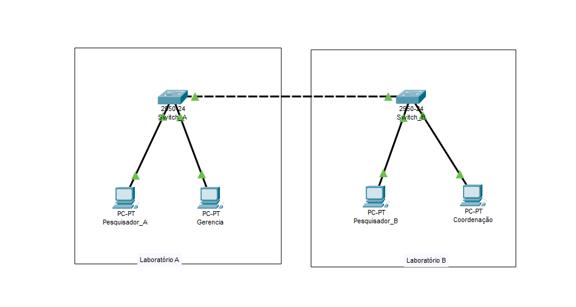
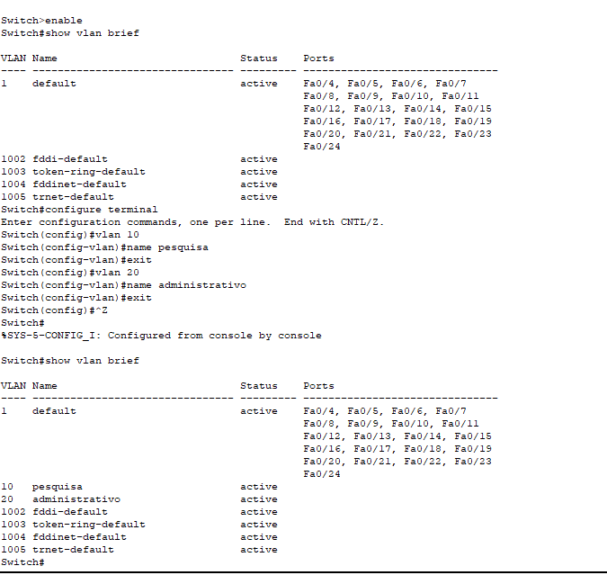
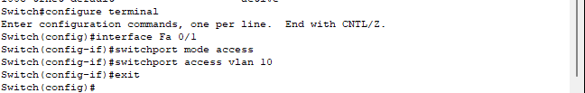
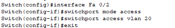
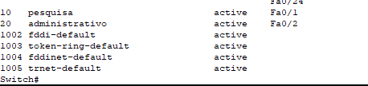

# VLANs

- Neste momento, criei 2 laboratórios e cada laboratório possui um switch e duas máquinas. Os dois laboratório estão se comunicando, os 2 switch estão sendo conectados através de um cabo cruzado. 

- Com isso feito, na hora de dar um ping de uma maquina para uma outra máquina que está em outro laboratório, o envio de pacotes será feito para todas as máquinas até encontrar a máquina que possui o endereçamento IP correspondente ao ip passado no ping. Para evitar esse congestionamento, melhorar o trafego de comunicação, criei uma VLAN. Em cada switch dos laboratórios, ativei a VLAN e fiz essas seguintes configurações:

- configure terminal -> entrei no modo de configuração no terminal
- show vlan brief -> Analisa todas as configurações de VLAN existente no switch. Cada vlan possui um identificador, sendo 1 a 1005
- vlan 10 e vlan 20 -> Criando uma vlan 
- na vlan 10, atribui um nome a essa vlan como pesquisa e na vlan 20 como administrativo

- Com isso criado, é necessário configurar/vincular a interface da porta fastEthernet para acesso a vlan criada que neste caso é a vlan 10:

- vlan 20

- Pronto, agora note que o comando **show vlan brief** vai mostrar as duas vlan criada com o status de **active**

