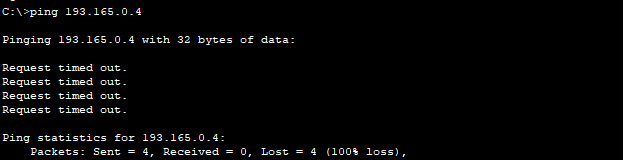
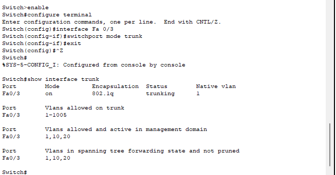
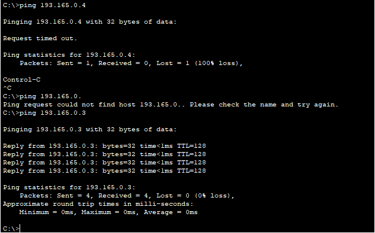
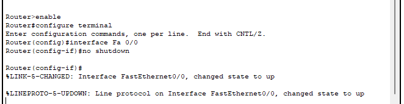
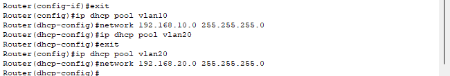
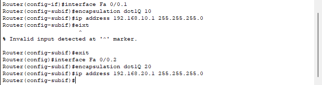
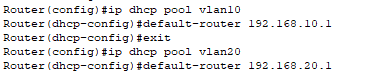
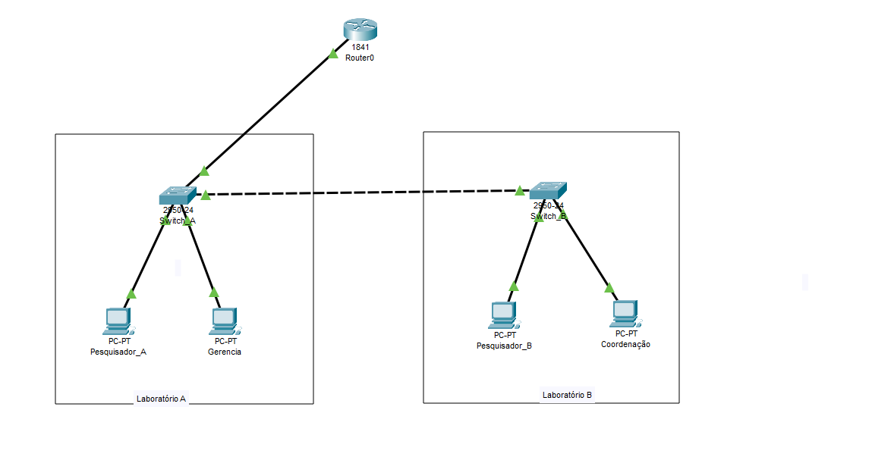

# VLANs

- Neste momento, criei 2 laboratórios e cada laboratório possui um switch e duas máquinas. Os dois laboratório estão se comunicando, os 2 switch estão sendo conectados através de um cabo cruzado. 

- Com isso feito, na hora de dar um ping de uma maquina para uma outra máquina que está em outro laboratório, o envio de pacotes será feito para todas as máquinas até encontrar a máquina que possui o endereçamento IP correspondente ao ip passado no ping. Para evitar esse congestionamento, melhorar o trafego de comunicação, criei uma VLAN. Em cada switch dos laboratórios, ativei a VLAN e fiz essas seguintes configurações:

- configure terminal -> entrei no modo de configuração no terminal
- show vlan brief -> Analisa todas as configurações de VLAN existente no switch. Cada vlan possui um identificador, sendo 1 a 1005
- vlan 10 e vlan 20 -> Criando uma vlan 
- na vlan 10, atribui um nome a essa vlan como pesquisa e na vlan 20 como administrativo

- Com isso criado, é necessário configurar/vincular a interface da porta fastEthernet para acesso a vlan criada que neste caso é a vlan 10:

- vlan 20

- Pronto, agora note que o comando **show vlan brief** vai mostrar as duas vlan criada com o status de **active**

- Fiz o mesmo processo para o segundo laboratório

- na hora de fazer um teste de conexão com o ping, o retorno de mensagem é timout, pois a interface que esta conectado entre os switch não está configurados para que os pacotes seja encaminhado para diferentes vlans configurados nos switchs.

- Configurando a interface da porta do switch

- enable -> entrei como root no switch
- configure terminal -> entrei na configuração do switch pelo terminal
- interface Fa 0/3 -> entrei na interface/porta que esta conectado o swtich
- switchport mode trunk -> ativa a interface para transmitir e receber pacotes de múltiplas VLANs

- Ao realizar o teste para o ip 193.168.0.4 recebo uma mensagem de timeout indicando um erro, porém ao fazer um ping no ip 193.168.0.3, funciona normalmente

- Isso ocorre porque a máquina Pesquisador_A e pesquisador_B estão conectados na mesma vlan, que é a vlan10. E o motivo de não conseguir realizar o ping no ip 193.165.0.4 é que esta em vlan diferente, durante o funcionamento as vlan não enxerga uma as outras, sendo assim, foi necessário um roteamento entre elas para que os pacotes saíam de um pc que esta em uma vlan para outro pc que esta em uma outra vlan.

- Ficou dessa forma o roteamento de vlans, para que a comunicação de pcs que estão em vlans diferentes se comuniquem com sucesso, por padrão quando adicionado um roteador no cisco

- Quando adicionado, ele vem com uma interface desligada e basta apenas configura-lo da seguinte forma: 

- Com a interface ligada, configurei o dhcp para cada uma das vlan existente no projeto.

- subinterface, para a comunicação ser efetiva com sucesso criei duas subinterface para que o dhcp funcione corretamente e atribua de forma automatica um endereço ip para os pc que estão em duas vlans diferentes. Sem a subinterface, o roteador não conseguirá atribuir o endereçamento ip para os dispositivos que estão em vlans diferentes e também para realizar o roteamento entre as vlans para que as máquinas consigam se comunicar

### vlan10
- interface Fa 0/0.1 -> criando uma subinterface 
- encapsulation dot1Q 10 -> vinculando a subinterface na vlan10
- ip address 192.168.10.1 255.255.255.0 -> atribuindo um endereço ip para a subinterface

### vlan20
- interface Fa 0/0.2 -> criando uma subinterface 
- encapsulation dot1Q 20 -> vinculando a subinterface na vlan20
- ip address 192.168.20.1 255.255.255.0 -> atribuindo um endereço ip para a subinterface

- gateway das vlans e subinterfaces criada, o gateway é a propria subinterface criada

- Ficando dessa forma:

# Rededundância de links com STP 